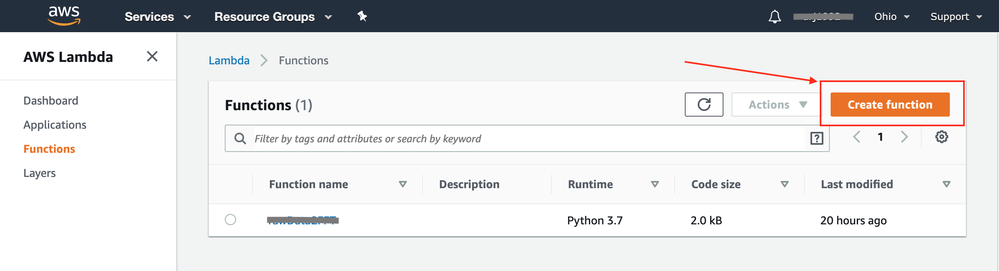
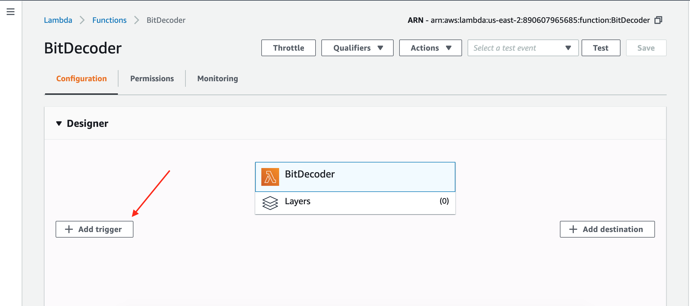
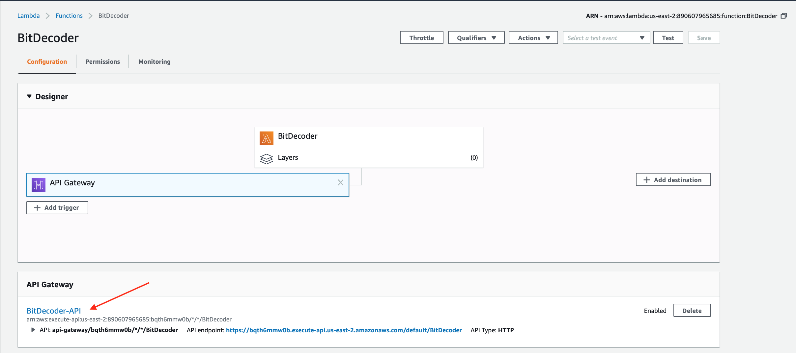
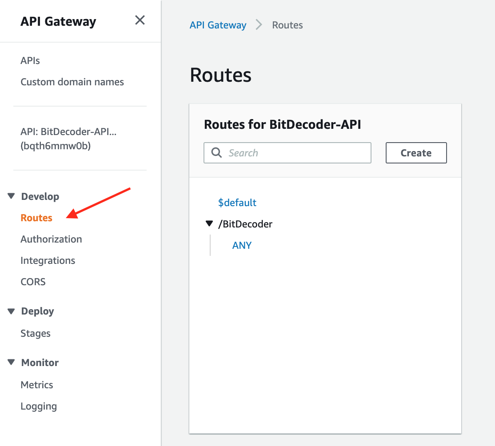
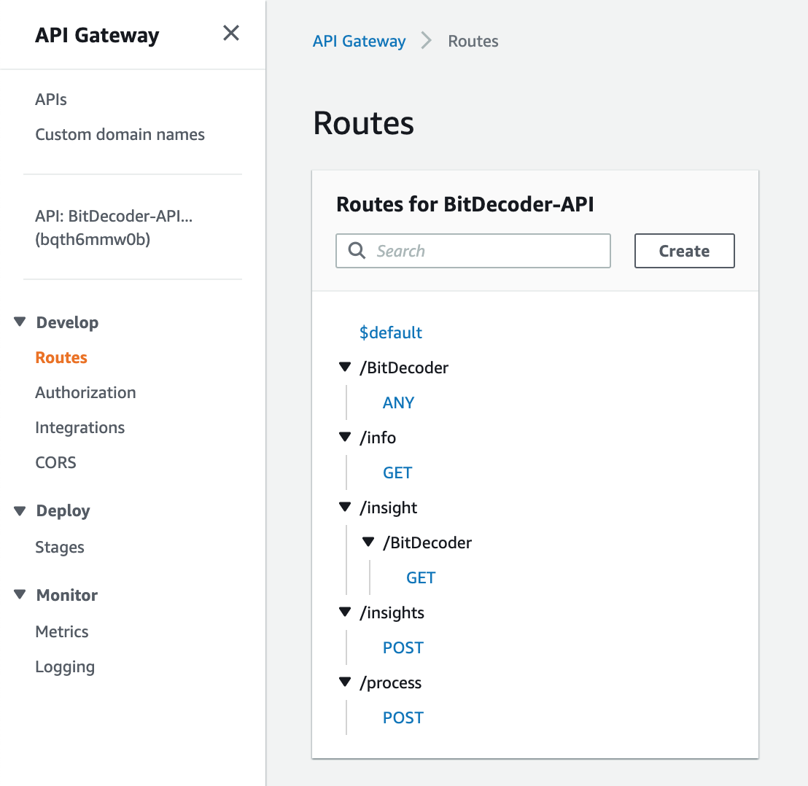
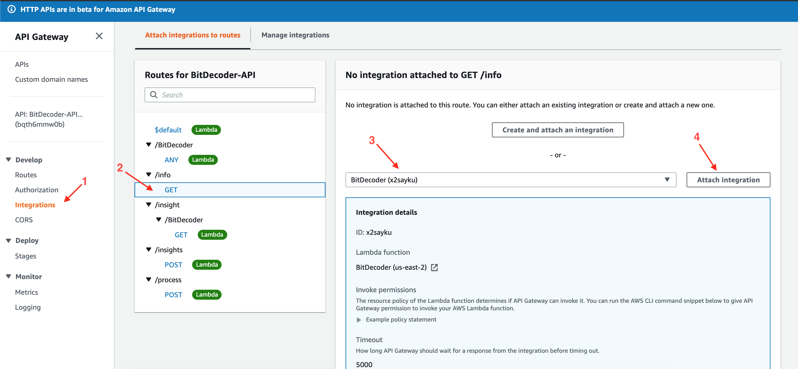

# Creating a custom Insight with AWS Lambda through example

In this document we will create a custom insight that has the following properties:
    Input: 
        An integer value represting a bit string
    Output:
        An Error message based on the corresponding bits


## Create New Lambda Function

Login to AWS console [here](https://signin.aws.amazon.com/)

In AWS Services, select 'Lambda' under 'All Services' -> 'Compute'


Create a new Lambda Function:


## Add Required API Endpoints

The required endpoints are described in Exosite documentation [here](https://docs.exosite.io/account/exosense/insights-overview#requirements)
In summary, 4 endpoints are required:
- GET /info
- GET /insight/{fn}
- POST /insights
- POST /process

These endpoints are implemented as Triggers, specifically 'API Gateway'.

### Create API Gateway
Add a new trigger to the lambda function and select 'API Gateway':


- Create a new API
- Select HTTP API
*Note* In this example we are using an [HTTP API](https://aws.amazon.com/blogs/compute/announcing-http-apis-for-amazon-api-gateway/) for simplicity. In production, users should consider REST API for enhanced security.

Once this is created, the API Gateway will appear at the bottom of the Configuration window for the Lambda function.


### Add Endpoints
Select this API Gateway (a new tab will open) 

Select 'Routes'


Select Create and add the 4 endpoints


### Attach Lambda to Endpoints
To have the lambda function get called via the newly created endpoints, the lambda function needs to be added as an integration.



Repeat this for each of the endpoints (All endpoints will point to the same lambda function)

## Modify the Lambda Function to handle the endpoints
Select the Lambda Function to edit the function code. The code editor will appear below the 'Designer' panel.


The code will by default be as follows:

```python
import json

def lambda_handler(event, context):
    # TODO implement
    return {
        'statusCode': 200,
        'body': json.dumps('Hello from Lambda!')
    }
```

### 'GET /info' endpoint
To handle the /info endpoint, replace the body of lambda\_handler() with the following code:

```python
    if event["requestContext"]["resourcePath"] == "/info":
        info = {
            'name': "BitDecoder",
            'description': "This is an example custom insight using an AWS Lambda function",
            'group_id_required': False,
            'wants_lifecycle_events': False
        }
        return {
            'statusCode': 200,
            'body': json.dumps(info)
        }
```
### 'GET /insight/{fn}' endpoint
For implementing this endpoint, create an object above the 'if' statement. This object will be re-used when handling the ```/insight``` endpoint
```python
    BitDecoder_function = {
        'id' : "bitDecoder",
        'name' : "Bit Decoder",
        'description' : "Decodes an integer value",
        'inlets' :
        [
            {
                'name': 'input_signal',
                'description': 'Input value',
                'primitive_type': 'integer'
            }
        ],
        'outlets':
        [
            {
                'name': 'output_signal',
                'description': 'Error string',
                'primitive_type': 'string'
            }
        ]
    }
```

return the  object (json-ized) when ```/insight/BitDecoder``` is called in a elif statement:

```python
    elif event["requestContext"]["resourcePath"] == "/insight/BitDecoder":
        return {
            'statusCode': 200,
            'body': json.dumps(BitDecoder_function)
        }
```

###  'POST /insights' endpoint
For implementing this endpoint, create an object above the 'if' statement that wraps all functions from the ```/insight/*``` endpoints

```python
    Insight = {
        'functions': 
        [
            BitDecoder_function
        ]
    }
```
return the  object (json-ized) when ```/insights``` is called in a elif statement:

```python
    elif event["requestContext"]["resourcePath"] == "/insights":
        retobj = {
            'total' : len(Insight["functions"]),
            'count' : len(Insight["functions"]),
            'insights': Insight["functions"]
        }
        return {
            'statusCode': 200,
            'body': json.dumps(retobj)
        }
```

### 'POST /process' endpoint
The ```/process``` endpoint handles the data transformation for the insight.

At the top of the file, create a function ```process_event``` that transforms the input event
```python
    def process_event(event):
        # Create the output object
        body = event["body"]
        body_obj = json.loads(body)
        print(json.dumps(body_obj))
        data = body_obj["data"][0]
        output = {}
        output["origin"] = data["origin"]
        output["generated"] = data["generated"]
        output["ts"] = data["ts"]
        output["tags"] = data["tags"]

        # Translate the data here
        input_value = data["value"]
        output['value'] = "Error " + str(input_value)

        return json.dumps([[output]])
```

and call it in the endpoint handler:

```python
    elif (event["requestContext"]["resourcePath"] == "/process"):
        return {
            'statusCode': 200,
            'body': process_event(event)
        }
```

## Final code

```python
import json

    BitDecoder_function = {
        'id' : "bitDecoder",
        'name' : "Bit Decoder",
        'description' : "Decodes an integer value",
        'inlets' :
        [
            {
                'name': 'input_signal',
                'description': 'Input value',
                'primitive_type': 'integer'
            }
        ],
        'outlets':
        [
            {
                'name': 'output_signal',
                'description': 'Error string',
                'primitive_type': 'string'
            }
        ]
    }

    Insight = {
        'functions': 
        [
            BitDecoder_function
        ]
    }

def process_event(event):
    # Create the output object
    body = event["body"]
    body_obj = json.loads(body)
    print(json.dumps(body_obj))
    data = body_obj["data"][0]
    output = {}
    output["origin"] = data["origin"]
    output["generated"] = data["generated"]
    output["ts"] = data["ts"]
    output["tags"] = data["tags"]

    # Translate the data here
    input_value = data["value"]
    output['value'] = "Error " + str(input_value)

    return json.dumps([[output]])

def lambda_handler(event, context):
    if event["requestContext"]["resourcePath"] == "/info":
        info = {
            'name': "BitDecoder",
            'description': "This is an example custom insight using an AWS Lambda function",
            'group_id_required': False,
            'wants_lifecycle_events': False
        }
        return {
            'statusCode': 200,
            'body': json.dumps(info)
        }
    elif event["requestContext"]["resourcePath"] == "/insight/BitDecoder":
        return {
            'statusCode': 200,
            'body': json.dumps(BitDecoder_function)
        }
    elif event["requestContext"]["resourcePath"] == "/insights":
        retobj = {
            'total' : len(Insight["functions"]),
            'count' : len(Insight["functions"]),
            'insights': Insight["functions"]
        }
        return {
            'statusCode': 200,
            'body': json.dumps(retobj)
        }
    elif (event["requestContext"]["resourcePath"] == "/process"):
        return {
            'statusCode': 200,
            'body': process_event(event)
        }
```


