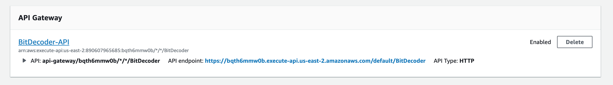
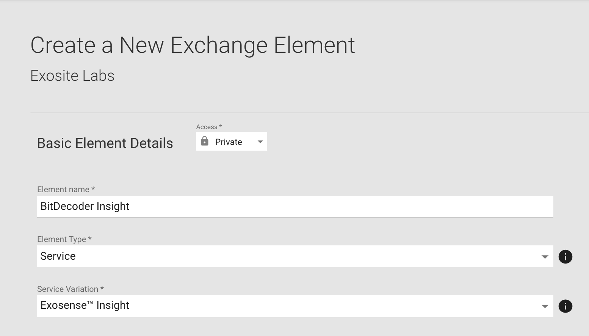
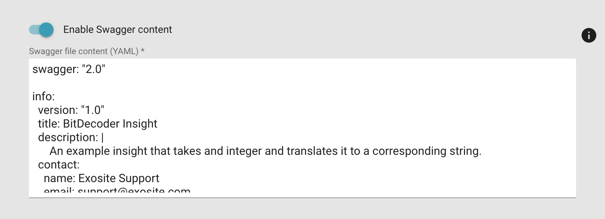

# Creating a custom Insight with AWS Lambda through example

In this document we will create a custom insight that has the following properties:
    Input: 
        An integer value represting a bit string
    Output:
        An Error message based on the corresponding bits


## Create New Lambda Function

Login to AWS console [here](https://signin.aws.amazon.com/)

In AWS Services, select 'Lambda' under 'All Services' -> 'Compute'


Create a new Lambda Function:


## Add Required API Endpoints

The required endpoints are described in Exosite documentation [here](https://docs.exosite.io/account/exosense/insights-overview#requirements)
In summary, 4 endpoints are required:
- GET /info
- GET /insight/{fn}
- POST /insights
- POST /process

These endpoints are implemented as Triggers, specifically 'API Gateway'.

### Create API Gateway
Add a new trigger to the lambda function and select 'API Gateway':


- Create a new API
- Select HTTP API
*Note* In this example we are using an [HTTP API](https://aws.amazon.com/blogs/compute/announcing-http-apis-for-amazon-api-gateway/) for simplicity. In production, users should consider REST API for enhanced security.

Once this is created, the API Gateway will appear at the bottom of the Configuration window for the Lambda function.


### Add Endpoints
Select this API Gateway (a new tab will open) 

Select 'Routes'


Select Create and add the 4 endpoints


### Attach Lambda to Endpoints
To have the lambda function get called via the newly created endpoints, the lambda function needs to be added as an integration.


Repeat this for each of the endpoints (All endpoints will point to the same lambda function)

## Modify the Lambda Function to handle the endpoints
Select the Lambda Function to edit the function code. The code editor will appear below the 'Designer' panel.

The final code can be found in the example\_code.py provided.


The code will by default be as follows:

```python
import json

def lambda_handler(event, context):
    # TODO implement
    return {
        'statusCode': 200,
        'body': json.dumps('Hello from Lambda!')
    }
```

### 'GET /info' endpoint
To handle the /info endpoint, replace the body of lambda\_handler() with the following code:

```python
    if event["requestContext"]["resourcePath"] == "/info":
        info = {
            'name': "BitDecoder",
            'description': "This is an example custom insight using an AWS Lambda function",
            'group_id_required': False,
            'wants_lifecycle_events': False
        }
        return {
            'statusCode': 200,
            'body': json.dumps(info)
        }
```
### 'GET /insight/{fn}' endpoint
For implementing this endpoint, create an object above the 'if' statement. This object will be re-used when handling the ```/insight``` endpoint
```python
    BitDecoder_function = {
        'id' : "bitDecoder",
        'name' : "Bit Decoder",
        'description' : "Decodes an integer value",
        'inlets' :
        [
            {
                'name': 'input_signal',
                'description': 'Input value',
                'primitive_type': 'numeric'
            }
        ],
        'outlets':
        [
            {
                'name': 'output_signal',
                'description': 'Error string',
                'primitive_type': 'string'
            }
        ]
    }
```

return the  object (json-ized) when ```/insight/BitDecoder``` is called in a elif statement:

```python
    elif event["requestContext"]["resourcePath"] == "/insight/BitDecoder":
        return {
            'statusCode': 200,
            'body': json.dumps(BitDecoder_function)
        }
```

###  'POST /insights' endpoint
For implementing this endpoint, create an object above the 'if' statement that wraps all functions from the ```/insight/*``` endpoints

```python
    Insight = {
        'functions': 
        [
            BitDecoder_function
        ]
    }
```
return the  object (json-ized) when ```/insights``` is called in a elif statement:

```python
    elif event["requestContext"]["resourcePath"] == "/insights":
        retobj = {
            'total' : len(Insight["functions"]),
            'count' : len(Insight["functions"]),
            'insights': Insight["functions"]
        }
        return {
            'statusCode': 200,
            'body': json.dumps(retobj)
        }
```

### 'POST /process' endpoint
The ```/process``` endpoint handles the data transformation for the insight.

At the top of the file, create a function ```process_event``` that transforms the input event
```python
    # Takes an integer value as an input value inside the event
    #   Outputs "Error <n>" with 'n' being the MSB of the provided integer
    #           "No Error" if there are no '1's in the binary representation
    #
    # Examples:
    # Input '0' -> Binary '0000' -> Output 'No Error'
    # Input '1' -> Binary '0001' -> Output 'Error 1'
    # Input '2' -> Binary '0010' -> Output 'Error 2'
    # Input '3' -> Binary '0011' -> Output 'Error 2'
    def process_event(event):
        # Create the output object
        body = event["body"]
        body_obj = json.loads(body)
        print(json.dumps(body_obj))
        data = body_obj["data"][0]
        output = {}
        output["origin"] = data["origin"]
        output["generated"] = data["generated"]
        output["ts"] = data["ts"]
        output["tags"] = data["tags"]

        # Translate the data here
        max_bit_position = -1
        input_value = int(data["value"])
        for i in range(31): # 32 bits in an integer in python
            if ((1<<i) & input_value != 0):
                max_bit_position = i + 1
        if (max_bit_position == -1):
            output['value'] = "No Error "
        else:
            output['value'] = "Error " + str(max_bit_position)

        return json.dumps([[output]])
```

and call it in the endpoint handler:

```python
    elif (event["requestContext"]["resourcePath"] == "/process"):
        return {
            'statusCode': 200,
            'body': process_event(event)
        }
```

## Publish Insight to the IoT Marketplace
In order to access the custom insight from ExoSense it needs to be published in the IoT marketplace and connected to the ExoSense instance. 

This example will show how to publish the insight privately so only the publishing business can access it.

### Create the insight.yaml file
When publishing a custom insight, a configuration YAML file is required.

Modify the info, host, and basePath sections of the Swagger template (insight\_template.yaml):

###Finding the host
In the API Gateway description, the host for the Swagger file can be found. Below is the example description.


The host is the 'API endpoint' with ```https://``` and ```/default/<api_gateway_name```

With this description, the host is:
```
bqth6mmw0b.execute-api.us-east-2.amazonaws.com
```


```yaml
swagger: "2.0"

info:
  version: "1.0"
  title: My Demo Insight
  description: |
    This demo Insight is a Functional Module that can be publsihed in Exosite's IoT Exchange
    and used within ExoSense.
  contact:
    name: Your Name Here
    email: YOU@BIZ.com

host: <AWS LAMBDA API HOST># Set this to the host your function is on (Example Custom Murano Hosted App Service, AWS, etc)
basePath: / # Set this or the path according to your function
tags:
  - name: insight
    description: Insight Module
schemes:
  - https  # Only https is supported.
consumes:
  - application/json # Only JSON is supported.
produces:
  - application/json # Only JSON is supported.

[...]
```

### Add Info



### Adding the Swagger file
The swagger file can be copy and pasted directly in if "Enable Swagger content" is selected. Otherwise, it can be published as a gist and the URL provided.



### Fill out the rest of the fields

### Publish
Once all fields a completed, select "Publish"

## Add to ExoSense
Select 'ADD TO SOLUTION" in the 'Element Details' page of the insight.

In the dropdown, select the ExoSense solution to add the insight to.


