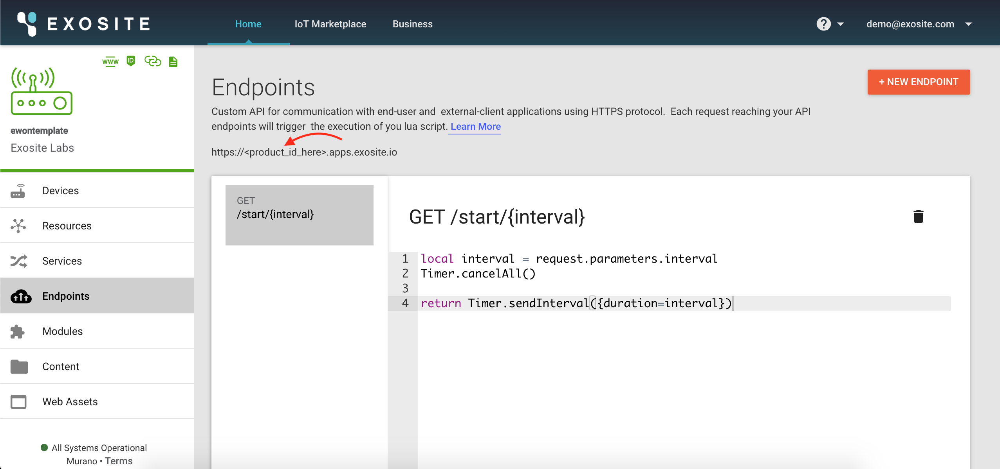
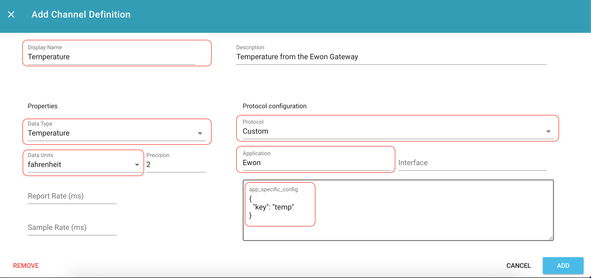

#Ewon Talk2M Connection
This guide will walk through connecting ExoSense to Ewon's Talk2M Cloud Platform

## Before you start
- Have an [ExoSense Account](https://info.exosite.com/exosense_pilot_package) and [access to Murano](www.exosite.io)
- Have your gateway sending data to [Ewon's Talk2m Cloud Platform](https://ewon.biz/cloud-services/talk2m)

## Create a New Product
In Murano, navigate to the ["Ewon Flexy Connector Template"](https://www.exosite.io/business/exchange/catalog/component/5d659a5de658fc4c1e7487d0) in the IoT Marketplace.

Select "Create IoT Connector" and input a name for your new Connector.

Navigate to the new IoT Connector in Murano, select "Manage IoT Connector". From here, navigate to the "Services" tab. 

Select the "Talk2mEwon" service, and input the following information: 
- Talk2M Username
- Talk2M account
- Talk2M Password
- Talk2m Developer ID

## Activate Polling
The Talk2M Ewon service polls data at regular intervals defined by the user. To activate this polling, an HTTP request needs to be made.

The endpoint is in the format `https://<product_id>.apps.exosite.io/start/<interval in ms>. To find the correct ProductID, navigate to the product in Murano and navigate to the Endpoints tab. 


One way to send the HTTP request is through [cURL](https://flaviocopes.com/http-curl/). For example to activate polling on a 5 minute interval with a product that has id `11223344556677889`, the following command should be sent:

```
curl https://11223344556677889.apps.exosite.io/start/300000
```

## Configure Data Channels
Once the service is polling for data from eWon Flexys, ExoSense will need information about how to interperet that data. First we must claim the device, then configure data channels in the device.

### Claim The Device
Devices can be claimed within ExoSense. Navigate to the 'Devices' tab in the left hand navigation window. Within the Devices page, navigate to the 'Unclaimed Devices' tab. From there, locate the device and assign it to a group. See more information [here](https://exosense.readme.io/docs/devices#section-assigning-ownership-of-devices)

If you're devices are not appearing, ensure the following:

- The Talk2M credentials provided are correct and that the desired gateways are part of the given group.
- The Ewon IoT Connector created is added to the ExoSense instance

Questions? Contact [support](mailto:support@exosite.com)


### Configure the Device
Within the device, in the channels tab, we will give ExoSense more information about the data being recieved.

An example configuration is shown with important fields highlighted. In this example the eWon Gateway is reporting a Temperature in Fahrenheit with a tag labeled 'temp'.



## Next Steps
Once you have a device configured in ExoSense, the next steps are to [create an asset](https://exosense.readme.io/docs/assets) and a [dashboard](https://exosense.readme.io/docs/dashboard-overview) to visualize your data.

