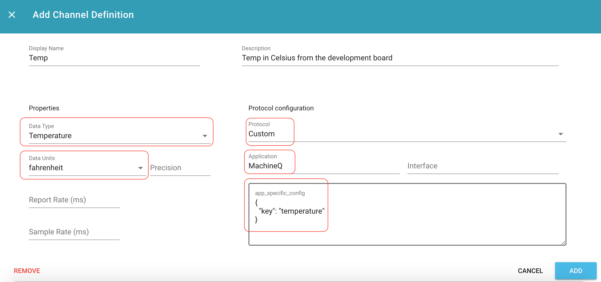

# MachineQ Connectivity

** This readme is in development ** 

This document will walk through connecting from MQcentral to ExoSense&trade;

## Prerequisites
- MachineQ MQcentral account [sign up here](https://mqcentral.machineq.net)
- Exosite Murano Account [sign up here](https://info.exosite.com/platform-sign-up)
- An active ExoSense instance

## Add a MachineQ product to Murano
- Navigate to the [MachineQ Template](https://www.exosite.io/business/exchange/catalog/component/5d790820c07390a50a8ae1f6) in the IoT Marketplace
- Select "Create IoT Connector" to add a MachineQ product

## Connect MQcentral to Murano
In this section, we will 'point' MQcentral to send data to Exosite&trade;

- In "Integrations" select "ADD OUTPUT PROFILE"
- Whithin the output profile created, add a REST Profile
- The URL for the REST Profile should be ```https://machineqgtw01.apps.exosite.io/vendor/data_in``` 

## Configure ExoSense
## Add the MachineQ IoT Connector to ExoSense
- Navigate to the [MachineQ IoT Connector](https://www.exosite.io/business//exchange/catalog/component/5d88fbf56dc7611e62f200b1) in the IoT Marketplace
- Select `ADD TO SOLUTION` 
- Select your ExoSense solution

### Claim the device
Claiming a device associates the device with a group, allowing for device organization and user permission control.

- In ExoSense, select "Devices" in the left navigation bar. From there, select "Unclaimed Devices" in the navigation ribbon.
- Locate the DevEUI and claim the device, assigning it to a group

### Configure the device
To visualize the data in ExoSense, the device needs to be configured to describe the data that it is recieving. This is done in the "Channels" tab of a device.

- Navigate to the "Devices" tab and locate the recently claimed device.
- Click on the device, and navigate to the "Channels" page in the device
- Add a new channel, by selecting the '+' button
- Configure the channel using a "Custom" Protocol with "MachineQ" Application, and the correct key that the data is being sent with. Below is an example of a configuration for getting the temperature from MachineQ's development board.


- Select "Add" to add the channel definition to the device
