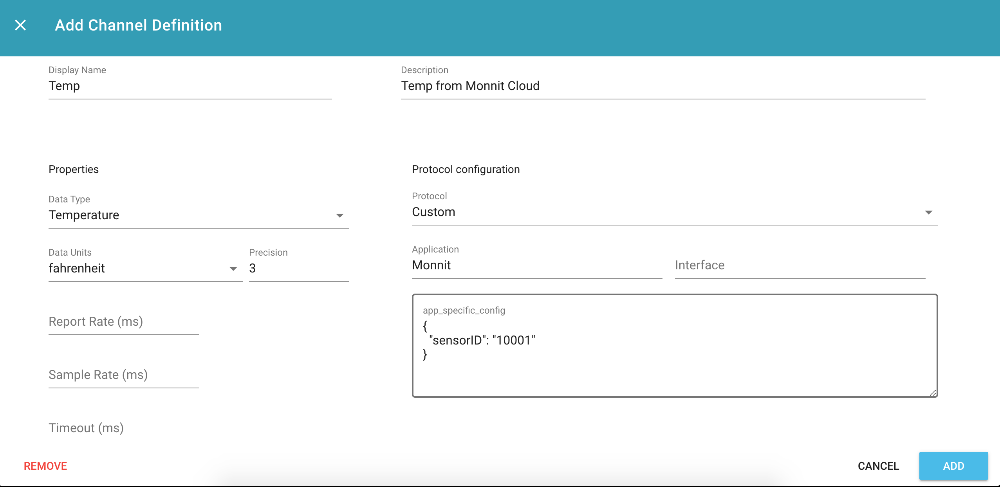

# Monnit Cloud Connection using Webhooks

This document walks through connecting Monnit and ExoSense. This uses [Monnit's webhook API](https://www.imonnit.com/API/webhook) and will send data to ExoSense when it is recieved by Monnit.

## Add Monnit Product to Murano

## Configure Monnit Webhook

## Configure Channels
In the device channels configuration, metadata about the data channels are defined.

The following channel configuration aligns with [Monnit's Webhook Example](https://www.imonnit.com/API/webhook)

Since in the example, SensorID 10001 is sending a temperature in Fahrenheit, the following configuration would be used:

Note: The app\_specific\_config must include a json blob with a key `"sensorID"` and Application defined as `Monnit` to correctly associate the data.