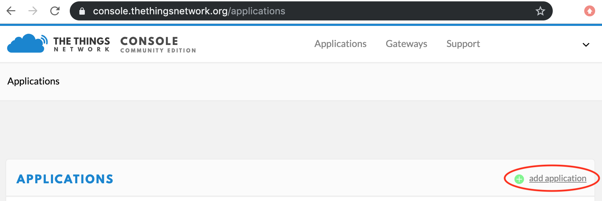
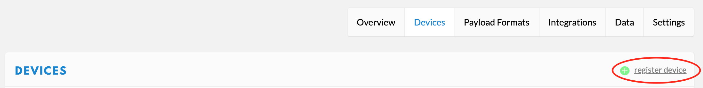
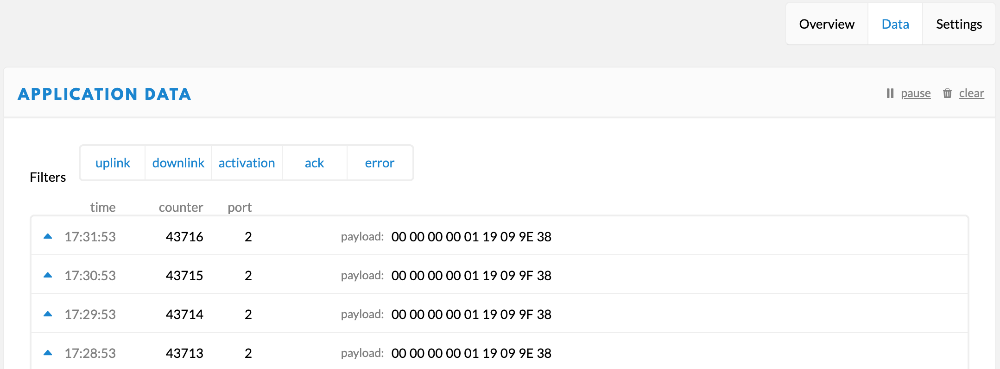
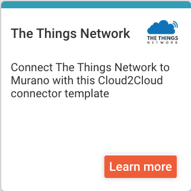
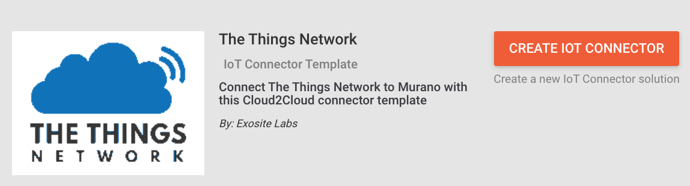

# TheThingsNetwork (TTN) and Murano Integration
The guide you will connect your TTN devices to your Exosite application.

## Table of Contents
   * [Verify TTN has Active Devices](#verify-ttn-has-active-devices)
   * [Configure Murano to Accept TTN Connections](#configure-murano-to-accept-ttn-connections)
   * [Connect TTN to Murano](#connect-ttn-console-to-murano)
   * [Configure Data Structure for ExoSense](#configure-data-structure-for-exosense)
   * [Add Device in ExoSense](#add-device-in-exosense)

## 1. Verify TTN has Active Devices
Setup TTN by: 
1.) Adding an Application 

2.) Registering a Device 

3.) Connecting the device to the TTN network per the device manufacturer's instructions 
4.) Verify the device is sending data 

## 2. Configure Murano to Accept TTN Connections
1.) Navigate to Murano and select "*IoT Marketplace*" in the top ribbon 
2.) In *IoT Connector Templates*, find and select "*TTN Connector Template*" 

3.) Click the "*Create IoT Connector*" button. This adds the Connector to your account. 

4.) Click "*Home*" to see your list of solutions and click the TTN Connector you deployed to "Manage IoT Connector"

## 3. Connect TTN to Murano
1.) In the enpoints tab of the product, copy the URL as shown below 
  
2.) Paste this URL into the API settings of console.radiobridge.com 
3.) Append the URL with '*/radiobridge*' 

## 4. Configure Data Structure for ExoSense
1.) In the enpoints tab of the produ

## 5. Add Device in ExoSense
[Connect your device to ExoSense.](../../master/ExoSense/README.md)

Once a message has been transmitted from the device, the device will appear in "Unclaimed Devices" in ExoSense

