# TheThingsNetwork (TTN) and Murano Integration
The guide you will connect your TTN devices to your Exosite application.  It uses [The Things Network C2C Template](https://github.com/exosite/TheThingsNetwork_Connector) - view the [ReadMe](https://github.com/exosite/TheThingsNetwork_Connector/blob/master/README.md) there for more detailed information.

## Table of Contents
   * [Verify TTN has Active Devices](#verify-ttn-has-active-devices)
   * [Configure Murano to Accept TTN Connections](#configure-murano-to-accept-ttn-connections)
   * [Connect TTN to Murano](#connect-ttn-console-to-murano)
   * [Use Devices in ExoSense](#use-devices-in-exosense)

## 1. Verify TTN has Active Devices
Setup TTN by: 
1.) Adding an Application 
 
2.) Registering a Device 
 
3.) Connecting the device to the TTN network per the device manufacturer's instructions 
4.) Verify the device is sending data 
 

## 2. Configure Murano to Accept TTN Connections
1.) Navigate to Murano and select "*IoT Marketplace*" in the top ribbon 
2.) In *IoT Connector Templates*, find and select "*TTN Connector Template*" 
 
3.) Click the "*Create IoT Connector*" button. This adds the Connector to your account. 
 
4.) Click "*Home*" to see your list of solutions and click the TTN Connector you deployed to "Manage IoT Connector"
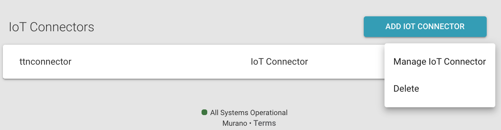 

## 3. Connect TTN to Murano
1.) In Murano, click the "WWW" icon in the upper left to spawn a new tab with the external URL of the connector - copy the URL from the browser address bar 
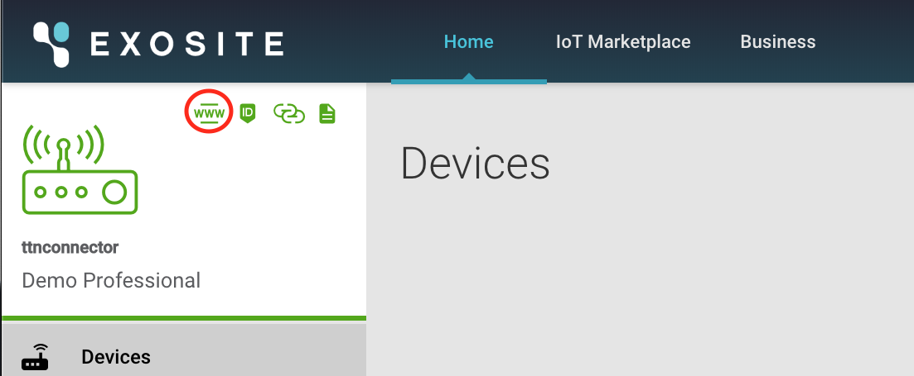 
2.) In TTN, go to the "Integrations" tab and click "add integration" and select the HTTP integration 
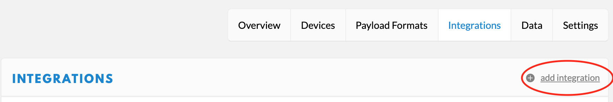 
3.) Paste the URL from step one into the URL field in the HTTP integration (URL of the endpoint), and add "c2c/callback" at the end of the URL to specify the specific endpoint that the HTTP integration should POST to 
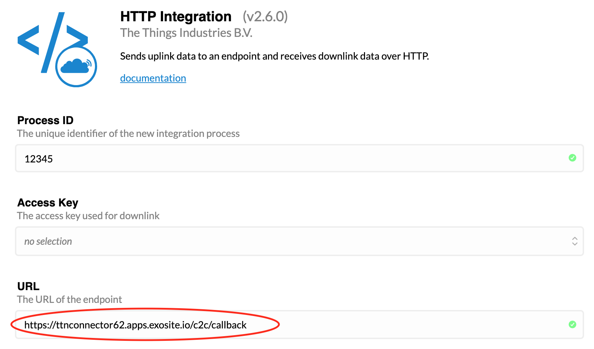 
4.) Set a unique identifier (any number) in the Process ID field, select the "default key" for the Access Kay, and click "Add Integration" to start flowing data! 
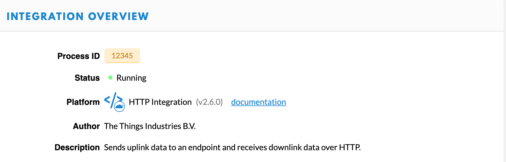 
5.) Verify the connection is working correctly by either generating real device events, or, on a TTN Device page, add some data to the "Simulate Uplink" field and click "Send."  In Murano, go to the Logs subpage of your TTN connector and every time TTN sends data, you should see a new log message generated.
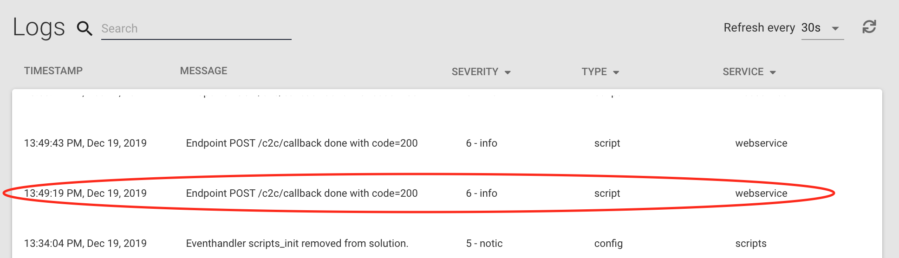 
6.) If everything is working perfectly, then the Devices subpage in Murano should also show devices being populated as new unique devices report data. 
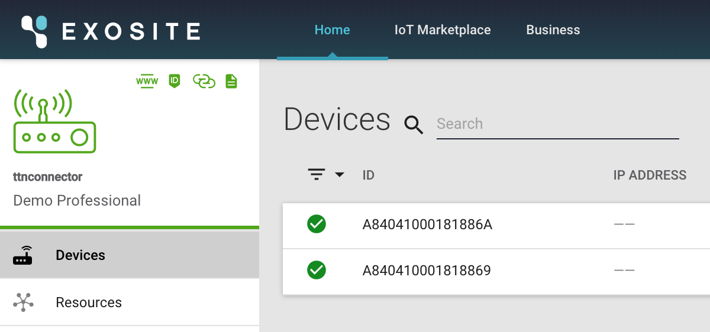 
 
*NOTE:* The TTN Connector Template is configured out of the box for a Dragino LT-33222-L LoRa I/O Controller.  If your device is different, it is likely that you will have to modify the out of the box settings as detailed at https://github.com/exosite/TheThingsNetwork_Connector (see the section "Configure the data structure for a different LoRa device").

## 4. Use Devices in ExoSense
Before being able to [Use your device in ExoSense.](../../master/ExoSense/README.md), we need to associate the connector with your ExoSense instance.  
1.) In Murano, when "Managing your IoT Connector," you'll notice a button that says "Publish as a Service" at the bottom of the left menu - click it. 
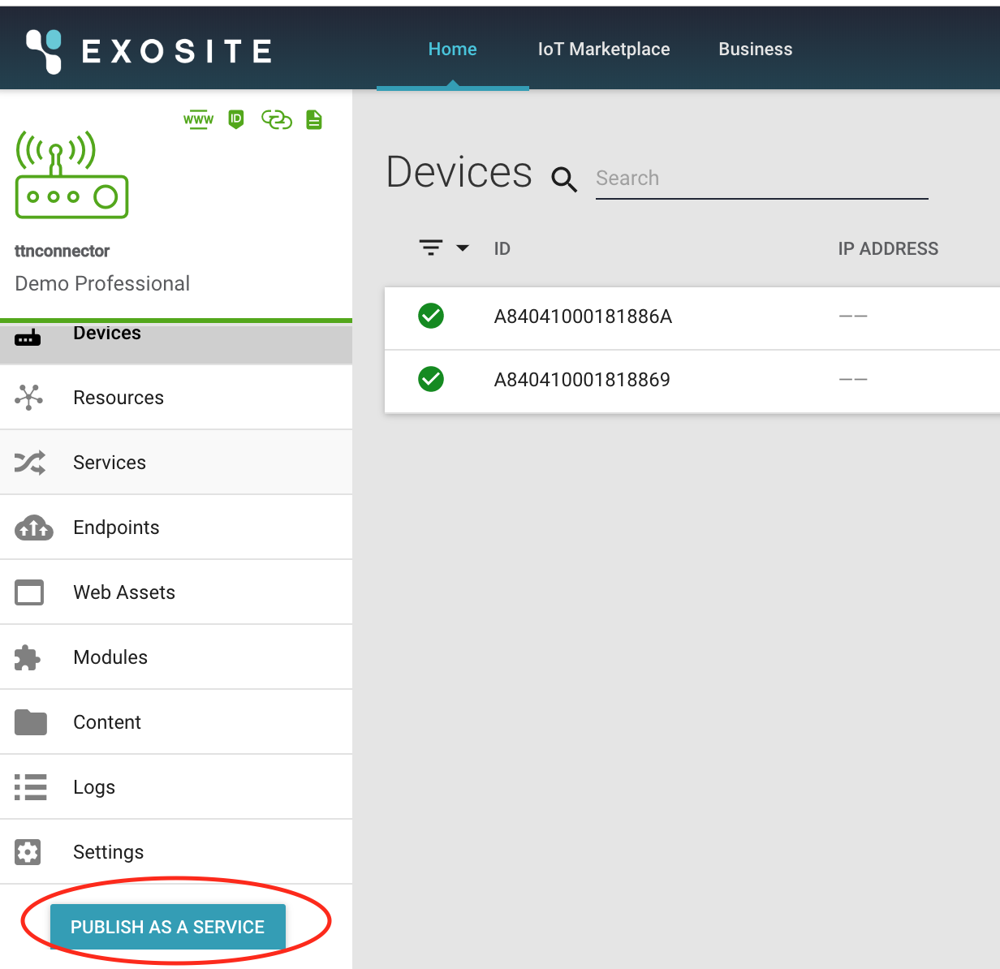 
2.) Make sure "Access" is set to "Private, fill in some recognizable details for the Element Name and Short Description, and click "Publish to Exchange". 
*NOTE:* If you set the Element Access to "Public" (if your subscription tier allows it), anyone using Murano may become a subscriber to your data.  While this could be a good thing, you'll likely want to implement additional claim of ownership capabilities that provide access controls and multi-tenancy to your connector - see the [IoT Connector as a Service documentation](http://docs.exosite.com/connectivity/pdaas/) for more details. 
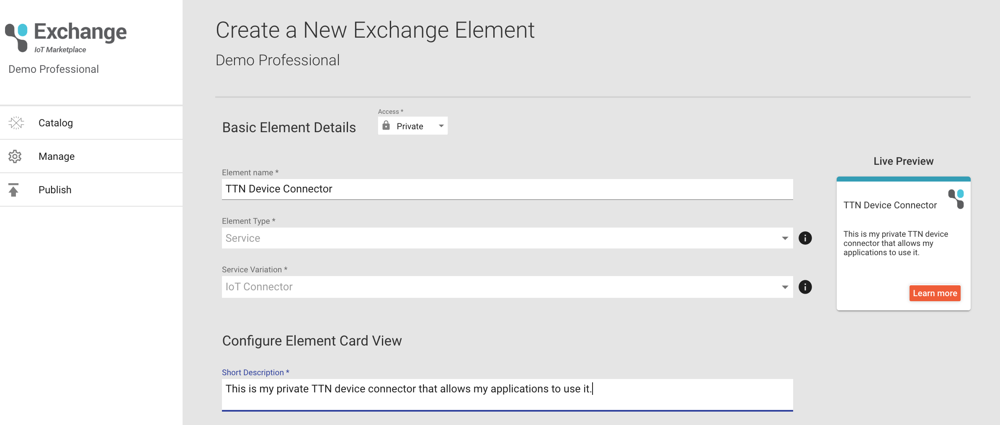 
3.) If everything goes well, you should see a success screen.  Otherwise, review your settings and try again. 
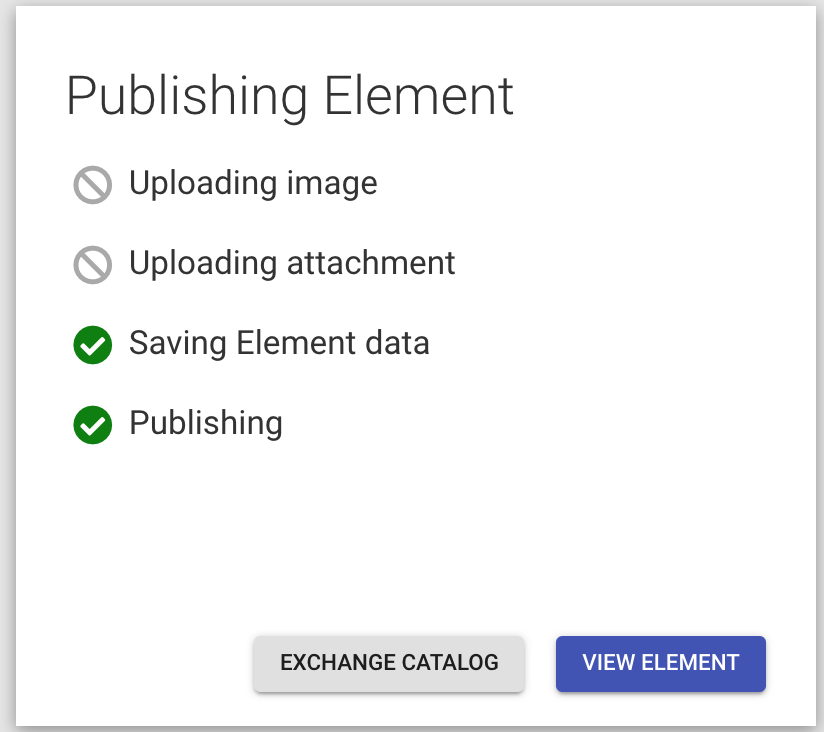 
4.) Click "View Element" and then "Add to Solution" and select your ExoSense application solution. 
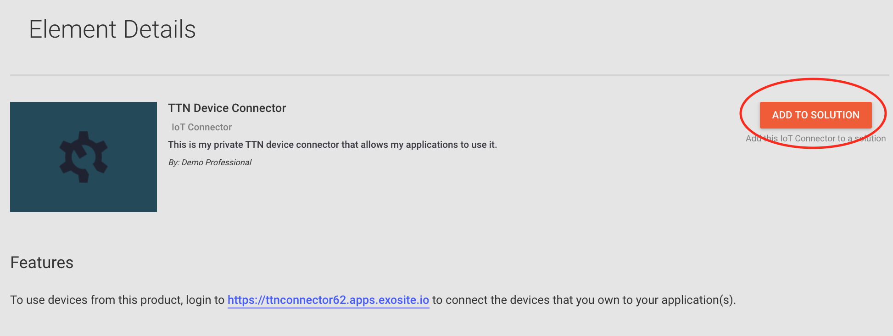 
5.) That is it!  Once a message has been transmitted from the device, the device will appear in "Unclaimed Devices" in ExoSense 
 
*NOTE:* There is one other way to associate an IoT Connector with ExoSense (or other applications) - by adding the business ID containing the app to the business "whitelist" in the C2C Connector's Interface service on the Services subpage.  This will also require the Application Owner to then go to "Manage Application" and click the checkbox in the "IoT Connector Setup" service (Services subpage) next to your TTN IoT Connector entry to enable it.    

